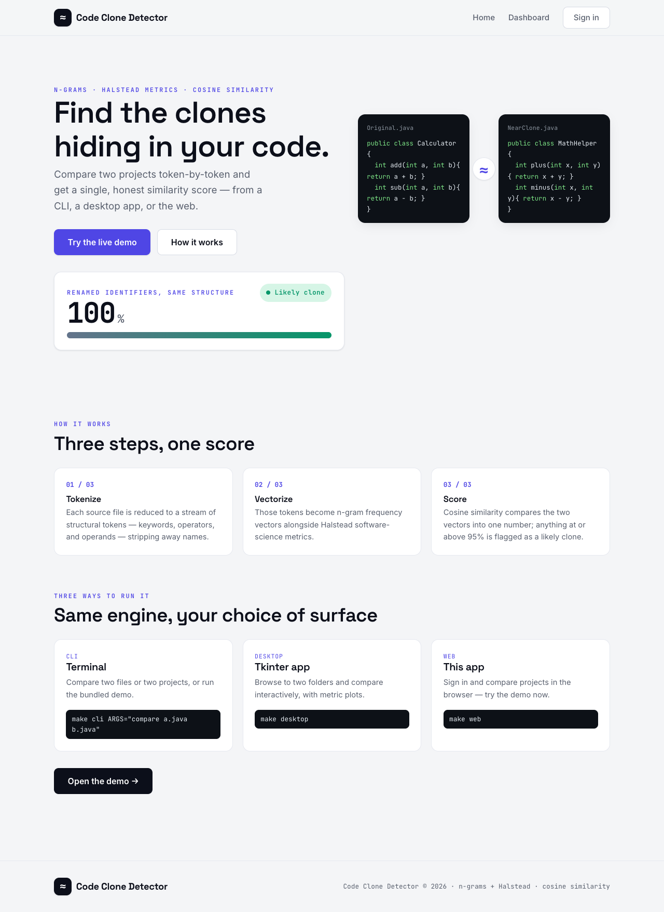
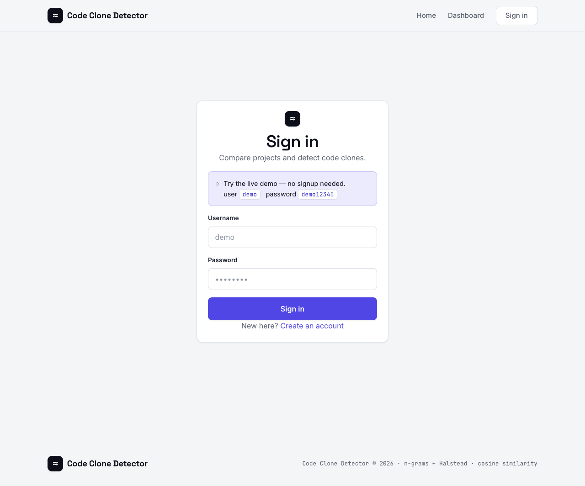
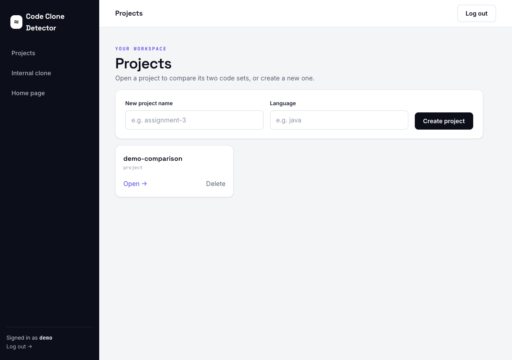
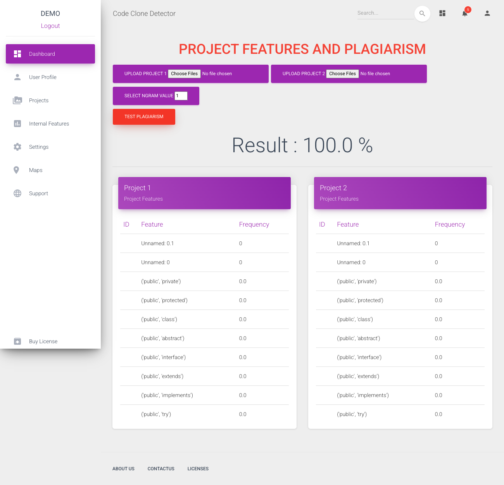
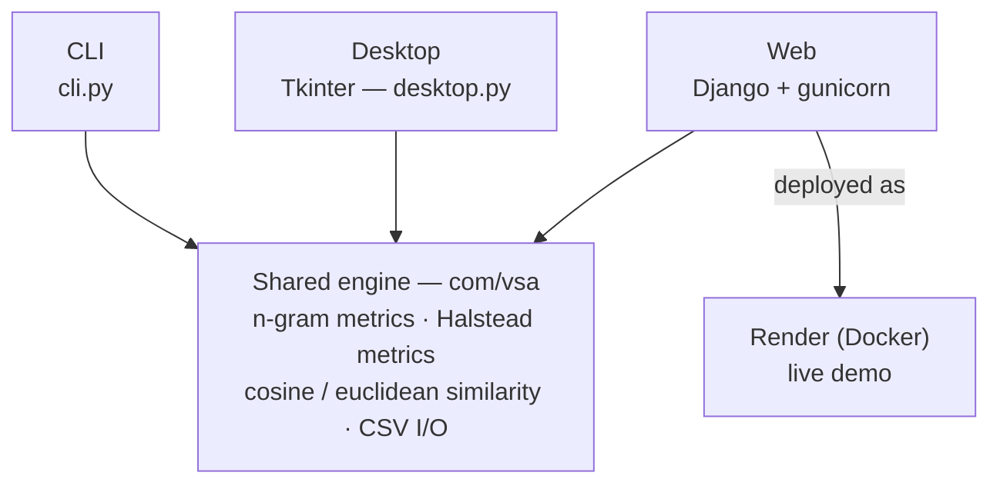

# Code Clone Detector

A Python tool that flags near-duplicate source files by comparing structural
n-grams and Halstead software-science metrics. Three front-ends — CLI, desktop
GUI, and a web app — share one detection engine.

## Live demo

The web app is live on [Render](https://render.com), deployed via the committed
[`render.yaml`](render.yaml) blueprint.

**▶ Live demo: https://code-clone-detector-3xng.onrender.com**

- Login: **`demo`** / **`demo12345`** (also shown as a hint on the login page)
- Render's free tier spins down when idle — the first request after a while can
  take **~30-50 seconds** to wake up. Subsequent requests are fast.

**Deploy your own (a few clicks):** connect this repo in the Render dashboard and
pick "New from Blueprint" — Render reads [`render.yaml`](render.yaml) and
provisions the web service (Docker runtime, env vars, generated `SECRET_KEY`)
automatically.

## Screenshots / demos

**Web app** — a clean, developer-focused UI. Log in with the seeded demo account
(`demo` / `demo12345`), open the pre-loaded `demo-comparison` project, and run a
comparison (no upload needed):



| Sign in | My Projects | Comparison result |
| --- | --- | --- |
|  |  |  |

**CLI** — actual `make demo` output:

```
Code Clone Detector — demo

A near-clone pair (renamed identifiers) and an unrelated pair:

  Original.java vs NearClone.java
    similarity: 100.00%   ->  LIKELY CLONE

  Original.java vs Unrelated.java
    similarity: 90.37%   ->  NOT A CLONE
```

**Desktop** — the Tkinter app (`make desktop`). Add a screenshot/GIF at
`docs/media/desktop.png` (capture steps in [`docs/media/README.md`](docs/media/README.md)).

## The three interfaces

**CLI** — compare two files or two project directories from a terminal, or run
the bundled demo pair.

```bash
make cli ARGS="compare samples/Original.java samples/NearClone.java"
make demo
```

**Desktop** — a Tkinter GUI for browsing to two folders and running a
comparison interactively, with plots of the underlying metrics.

```bash
make desktop
```

**Web** — an authenticated Django dashboard for uploading and comparing
projects, backed by the same engine and deployable via Docker/Render.

```bash
make web
```

Quickest way to see a result: log in as `demo` / `demo12345` → **My
Projects** → open the seeded **demo-comparison** project → click **TEST
PLAGIARISM** (no upload needed — it's pre-loaded with `samples/Original.java`
and `samples/NearClone.java`) → the similarity result renders on the same
page. You can also create your own project and upload two folders of `.java`
files to compare instead.

## Architecture

One shared engine (`com/vsa`) does the actual work — tokenizing source,
computing n-gram and Halstead features, and scoring similarity. Each front-end
is just a different way to drive it; the web front-end is additionally
containerized and deployed to Render. Full breakdown in
[`docs/architecture.md`](docs/architecture.md).



## How it works (be honest)

Each file is tokenized into a stream of structural tokens, then turned into
**bi-grams (n-grams)** of those tokens plus a set of **Halstead software-science
metrics** (operator/operand counts, vocabulary, length, volume, ...). The two
feature vectors are compared with **cosine similarity** (and, for some paths,
**Euclidean distance**) to produce a single similarity score.

This measures **structural** similarity, not semantic equivalence — two
files in the *same language* will always score high in absolute terms, because
much of their token structure (braces, keywords, common control flow) overlaps
regardless of what the program does. In practice the useful signal is the
**relative ordering**, not the raw percentage: in this demo, a near-clone
scores **~100%** while unrelated code scores **~90%**, so the **0.95**
similarity threshold cleanly separates them. The tool flags anything at or
above that threshold as a likely clone — see the comment on
`CLONE_THRESHOLD` in [`cli.py`](cli.py) for the measured distribution
behind that number.

## Run it locally

```bash
make setup   # creates .venv, installs deps, downloads nltk data, installs git hooks, migrates DB, seeds demo user
make web     # Django dev server at http://127.0.0.1:8000
make demo    # CLI demo on bundled samples
make cli ARGS="compare samples/Original.java samples/NearClone.java"
make desktop # Tkinter GUI
make scan    # scan the whole tree for secrets on demand
```

Notes:

- `make setup` requires **Python 3.12**.
- `make desktop` needs a system Tk install. On macOS, use a python.org build of
  Python (bundles Tk) or `brew install python-tk`; the Homebrew/pyenv default
  build often ships without Tk support.

### Secret scanning

A [gitleaks](https://github.com/gitleaks/gitleaks) pre-commit hook scans every
staged diff and blocks the commit if a secret is detected. `make setup` installs
it automatically; on an existing clone run `make hooks` once (needs
`pip install pre-commit`). Scan the full tree any time with `make scan`.

## Tech stack

- **Language:** Python 3.12
- **Web:** Django 4.2, gunicorn, WhiteNoise
- **Engine:** numpy, pandas, scipy, scikit-learn, nltk
- **Desktop:** Tkinter, Pillow, matplotlib
- **Packaging/deploy:** Docker, Render

## Credits

This is a revived and modernized version of a university project originally
built by the repo owner ([a6dulrauf](https://github.com/a6dulrauf)). The
revival fixed engine crashes under modern library versions, hardcoded paths,
and packaging issues, then added the CLI, containerization, and Render
deployment — the core n-gram/Halstead detection algorithm itself is unchanged
from the original coursework.
