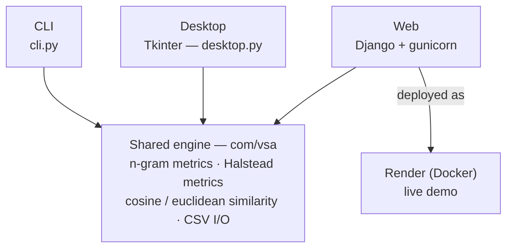

# Architecture

One shared detection engine, three independent front-ends. The engine does all the
work (tokenizing source, computing n-gram/Halstead features, scoring similarity,
writing CSVs); each front-end is just a different way to drive it.

- **CLI** (`cli.py`) — `compare`, `compare-projects`, and `demo` subcommands for
  quick file/project comparisons from a terminal.
- **Desktop** (`desktop.py`) — a Tkinter GUI (`com/vsa/gui/gui.py`) for browsing
  folders and viewing plagiarism results/plots interactively.
- **Web** (Django) — an authenticated dashboard for uploading and comparing
  projects, served by gunicorn behind WhiteNoise for static files, containerized
  with Docker, and deployed to Render via the committed `render.yaml` blueprint.

All three call into the same `com/vsa` package, so a fix or metric change made in
the engine benefits every front-end at once.
